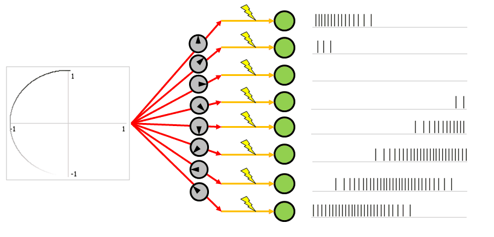
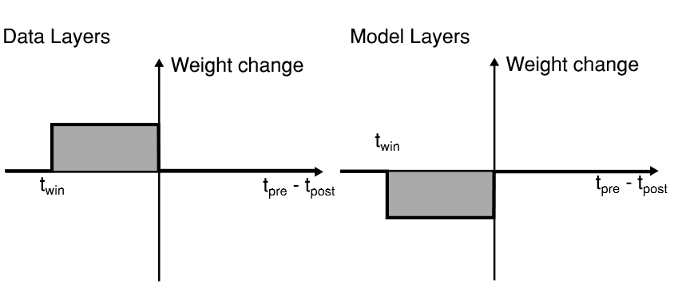
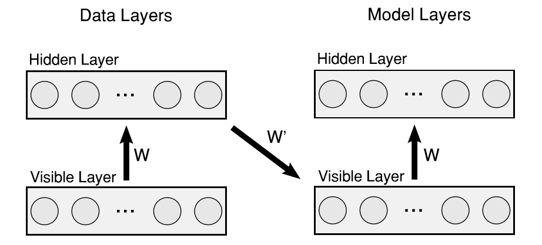
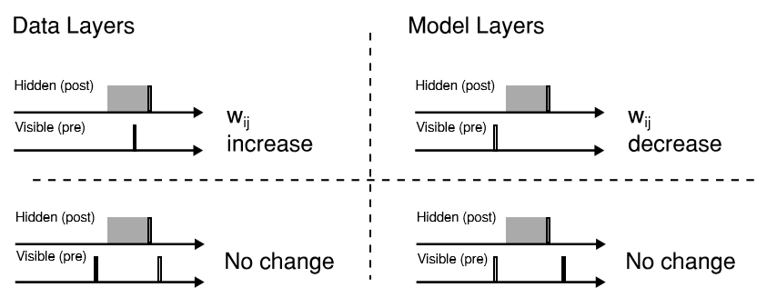

# Spiking-Restricted-Boltzmann-Machine

<p align="center">
  
</p>

This is a (optimized) Python implemenation of Master thesis **[Online Learning in Event based Restricted Boltzmann Machines](http://dannyneil.com/attach/dneil_thesis.pdf)** by Daniel Neil

## Introduction

Spiking neural networks (SNNs) fall into the third generation of neural network models, increasing the level of realism in a neural simulation. In addition to neuronal and synaptic state, SNNs also incorporate the concept of time into their operating model. The idea is that neurons in the SNN do not fire at each propagation cycle (as it happens with typical multilayer perceptron networks), but rather fire only when a membrane potential an intrinsic quality of the neuron related to its membrane electrical charge reaches a specific value. When a neuron fires,it generates a signal which travels to other neurons which, in turn, increase or decrease their potentials in accordance with this signal. 

<p align="center">
  
</p>
<p align="center">
  **Network topology of a Restricted Boltzmann Machine**
</p>

Restricted Boltzmann Machines(RBMs) and Deep Belief Networks have been demonstrated to perform efficiently in a variety of applications,such as dimensionality reduction, feature learning, and classification. Their implementation on neuromorphic hardware platforms emulating large-scale networks of spiking neurons can have significant advantages from the perspectives of scalability, power dissipation and real - time interfacing with the environment. Traditional RBM structures use **Contrastive Divergence(CD)** algorithm to train the network which is based on discrete updates. Here, the CD algorithm is modified to its spiking version in which weight update takes place according to **Spike Time Dependent Plasticity** rule.

### Spike Time Dependent Plasticity

STDP is actually a biological process used by brain to modify it's neural connections (synapses). Since the unmatched learning efficiency of brain has been appreciated since decades, this rule was incorporated in ANNs to train a neural network. Moulding of weights is based on the following two rules - 
* Any synapse that contribute to the firing of a post-synaptic neuron should be made strong.
* Synapses that don't contribute to the firing of a post-synaptic neuron should be dimished.

<p align="center">
  
</p>

Following the above rules give us an algorithm for updating weights.
- If a pre synaptic neurons fires before a post synaptic neuron then corresponding synapse should be made strong by a factor proportional to the time difference between the spikes. Lesser the time diference between post synaptic and pre synaptic spikes, more is the contribution of that synapse in post synaptic firing and hence greater is change in weight (positive).
- If a pre synaptic neuron fires after a post synaptic neuron then corresponding synapse should be diminished by a factor proportional to the time difference between the spikes. Lesser the time diference between post synaptic and pre synaptic spikes, lesser is the contribution of that synapse in post synaptic firing and hence greater is change in weight (negative).

This rule of weight update has been used in the CD algorithm here to train the Spiking RBM. In this implementation of STDP, the change in weight is kept constant in the entire stdp window.

<p align="center">
  
</p>

## Contrastive Divergence

It is an algorithm used to train RBMs by optimizing the weight vector. [Here](https://www.youtube.com/watch?v=MD8qXWucJBY) is a tutorial to understand the algorithm. Also, the spiking implementation is explained in detail in D.Neil's [thesis](http://dannyneil.com/attach/dneil_thesis.pdf).

In the spiking version of this algorithm, STDP is used to calculate the weight change in forward and reconstruction phase. Four different populations of neurons were created to simulate the phases. 

<p align="center">
  
</p>

Weight changes from data layers result in potentiation of synapses while those in model layers result in depreciation. Also, weight change is calculated only when hidden layer neuron fires.

<p align="center">
  
</p>

The figure above shows how delta_w is calculated when hidden layer neuron fires. The gray region represents stdp window. Any presynaptic spike outside window results in no change in weight.

## Directory Structure

- To use this code, srbm directory must be appended to the PYTHONPATH or if you are using a Python package manager (Anaconda) this folder needs to be included in the Python2.7 site packages folder.
- All the code relevant to SRBM is in srbm/snn/CD.
- Input data need to be placed in srbm/input/kaggle_input directory. Kaggle's MNIST data was used in this experiment. Path to input data could be changed in srbm/snns/CD/main.py.
- All the network parameters are included in srbm/snns/CD/main.py with explanations. If executing from a terminal use this command to get full help

```
python main.py --help
```


Here is the structure of srbm with summary of each file - 
```
  |-- srbm
    |-- input
      |-- kaggle_input         #Contains all input data in form of csv
    |-- snns
      |-- CD
        |-- common.py          #Contains all useful functions (load data, prepare dataset, etc)
        |-- time_stepped.py    #Discrete time stepped implementation of CD
        |-- main.py            #Contains all parameters and function calls
        |-- visual.py          #Visualization functions
        
```

## Parameter Optimizations

D.Neil's implementation of SRBM for MNIST handwritten digits classification converged to an **accuracy of 80%**. I did some of my own optimizations to improve the performance. I was able to touch **88%** mark. Also, I obtained an accuracy of **94%** using SRBM as a feature extractor. Following are the parameter tuning I performed with logical reasoning.

### 
