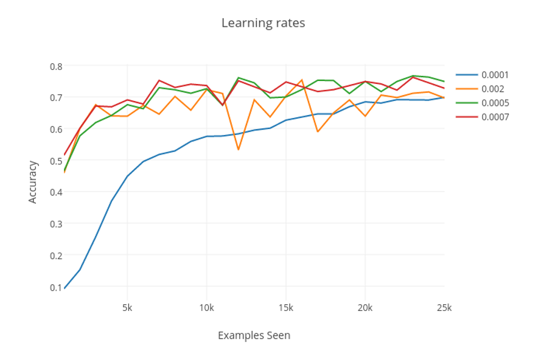
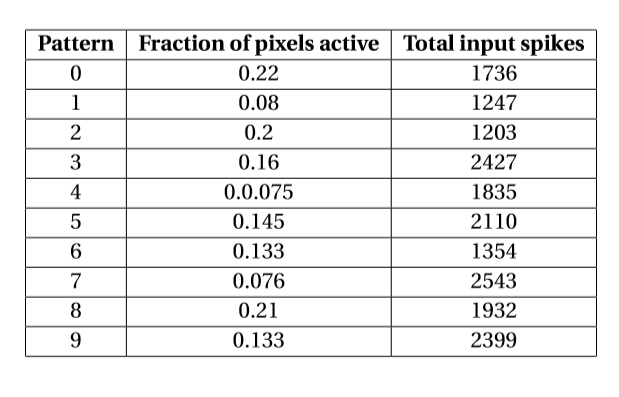
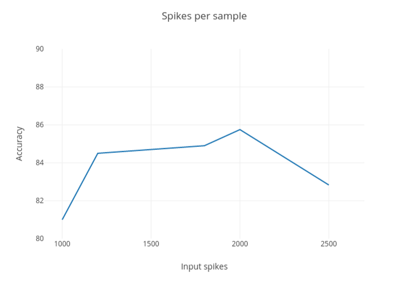
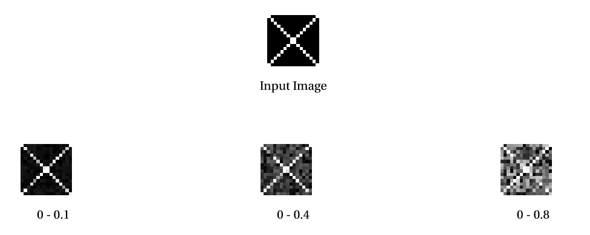

# Spiking-Restricted-Boltzmann-Machine

<p align="center">
  
</p>

This is a (optimized) Python implemenation of Master thesis **[Online Learning in Event based Restricted Boltzmann Machines](http://dannyneil.com/attach/dneil_thesis.pdf)** by Daniel Neil

## Introduction

Spiking neural networks (SNNs) fall into the third generation of neural network models, increasing the level of realism in a neural simulation. In addition to neuronal and synaptic state, SNNs also incorporate the concept of time into their operating model. The idea is that neurons in the SNN do not fire at each propagation cycle (as it happens with typical multilayer perceptron networks), but rather fire only when a membrane potential an intrinsic quality of the neuron related to its membrane electrical charge reaches a specific value. When a neuron fires,it generates a signal which travels to other neurons which, in turn, increase or decrease their potentials in accordance with this signal. 

<p align="center">
  
</p>
<p align="center">
  **Network topology of a Restricted Boltzmann Machine**
</p>

Restricted Boltzmann Machines(RBMs) and Deep Belief Networks have been demonstrated to perform efficiently in a variety of applications,such as dimensionality reduction, feature learning, and classification. Their implementation on neuromorphic hardware platforms emulating large-scale networks of spiking neurons can have significant advantages from the perspectives of scalability, power dissipation and real - time interfacing with the environment. Traditional RBM structures use **Contrastive Divergence(CD)** algorithm to train the network which is based on discrete updates. Here, the CD algorithm is modified to its spiking version in which weight update takes place according to **Spike Time Dependent Plasticity** rule.

### Spike Time Dependent Plasticity

STDP is actually a biological process used by brain to modify it's neural connections (synapses). Since the unmatched learning efficiency of brain has been appreciated since decades, this rule was incorporated in ANNs to train a neural network. Moulding of weights is based on the following two rules - 
* Any synapse that contribute to the firing of a post-synaptic neuron should be made strong.
* Synapses that don't contribute to the firing of a post-synaptic neuron should be dimished.

<p align="center">
  
</p>

Following the above rules give us an algorithm for updating weights.
- If a pre synaptic neurons fires before a post synaptic neuron then corresponding synapse should be made strong by a factor proportional to the time difference between the spikes. Lesser the time diference between post synaptic and pre synaptic spikes, more is the contribution of that synapse in post synaptic firing and hence greater is change in weight (positive).
- If a pre synaptic neuron fires after a post synaptic neuron then corresponding synapse should be diminished by a factor proportional to the time difference between the spikes. Lesser the time diference between post synaptic and pre synaptic spikes, lesser is the contribution of that synapse in post synaptic firing and hence greater is change in weight (negative).

This rule of weight update has been used in the CD algorithm here to train the Spiking RBM. In this implementation of STDP, the change in weight is kept constant in the entire stdp window.

<p align="center">
  
</p>

## Contrastive Divergence

It is an algorithm used to train RBMs by optimizing the weight vector. [Here](https://www.youtube.com/watch?v=MD8qXWucJBY) is a tutorial to understand the algorithm. Also, the spiking implementation is explained in detail in D.Neil's [thesis](http://dannyneil.com/attach/dneil_thesis.pdf).

In the spiking version of this algorithm, STDP is used to calculate the weight change in forward and reconstruction phase. Four different populations of neurons were created to simulate the phases. 

<p align="center">
  
</p>

Weight changes from data layers result in potentiation of synapses while those in model layers result in depreciation. Also, weight change is calculated only when hidden layer neuron fires.

<p align="center">
  
</p>

The figure above shows how delta_w is calculated when hidden layer neuron fires. The gray region represents stdp window. Any presynaptic spike outside window results in no change in weight.

## Directory Structure

- To use this code, srbm directory must be appended to the PYTHONPATH or if you are using a Python package manager (Anaconda) this folder needs to be included in the Python2.7 site packages folder.
- All the code relevant to SRBM is in srbm/snn/CD.
- Input data need to be placed in srbm/input/kaggle_input directory. Kaggle's MNIST data was used in this experiment. Path to input data could be changed in srbm/snns/CD/main.py.
- All the network parameters are included in srbm/snns/CD/main.py with explanations. If executing from a terminal use this command to get full help

```
python main.py --help
```


Here is the structure of srbm with summary of each file - 
```
  |-- srbm
    |-- input
      |-- kaggle_input         #Contains all input data in form of csv
    |-- snns
      |-- CD
        |-- common.py          #Contains all useful functions (load data, prepare dataset, etc)
        |-- time_stepped.py    #Discrete time stepped implementation of CD
        |-- main.py            #Contains all parameters and function calls
        |-- visual.py          #Visualization functions
        
```

## Parameter Optimizations

D.Neil's implementation of SRBM for MNIST handwritten digits classification converged to an **accuracy of 80%**. I did some of my own optimizations to improve the performance. I was able to touch **~87%** mark. Also, I obtained an accuracy of **94%** using SRBM as a feature extractor. Following are the parameter tuning I performed with logical reasoning.

### Learning Rate
This parameter determines the size of a weight update when a hidden layer neuron spikes, and controls how quickly the system changes its weights to approximate the input distribution. It is considered to be the most basic parameter of any neural network. There is a trade off associated with this parameter and can be explained by the same experiment done above. Here are the result of training a simple network for different rates.

<p align="center">
  
</p>

- Higher learning rate develop fast receptive fields but in improper way. Accuracies increase fast but reaches a plateau much earlier (can be seen from the graph below).
- Lower learning rate results in better training but requires more samples (more time) to reach the highest accuracy.

Here is an experimental graph comparing different learning rates on the basis of the maximum accuracies achieved in a single run.

<p align="center">
  
</p>

**Learning rate of 0.0005** was chosen to be the optimized value.

### Spikes Per Sample

This parameter, also know as **Luminosity**, defines the spiking activity of the network quantitatively. It is preferred to keep the activity as low as possible (enough to change the weights). We have kept a maximum bound on the number of spikes that an input can generate. Without this moderation, there will be no uniformity in the input activity across all the patterns. Here below is a table showing an analysis of all the patterns (digits) in MNIST dataset depicting the activity of each of them.

<p align="center">
  
</p>

It was observed from the heatmaps generated after complete training of the  RBM that the patterns with lower spiking activity performed better. This observation gave an idea of limiting the number of spikes for each pattern to a maximum value and it helped to improve the efficiency significantly. 

Graph below is an account of how accuracy changed with the number of maximum input spikes after 3 epochs each consisting of 30k samples.

<p align="center">
  
</p>

**2000 spikes per sample was chosen as the optimized parameter value**

### Weight Initialization

The range of uniformly distributed weights used to initialize the network play a very significant role in training which most of the times is not considered properly. Properly initializing the weights can save significant computational effort and have drastic results on the eventual accuracy. 

Generally, the weights are initialized between 0-1. Here is a simple experiment to demonstrate the importance of this parameter. A simple spiking network was constructed (using BRIAN simulator) with one output neuron (as only one class was to be presented). A single pattern **X** was presented to the network for a fixed duration, which was enough to mould the weights, at different initialization values.

<p align="center">
  
</p>

It can be clearly seen that higher the upper bound, more noise is fed into the network which is difficult for the network to overcome with or may require the sample to be presented for a longer duration. There are two options:

- By initializing the weights closer to the extrema, the training decreases weights to yield features rather than sharpening weights that are already present. For this it is necessary to increase the duration of each image and also incorporate some muting functionality to get rid of the noise in **off** regions.

- By initializing them closer to minima we give network freedom to modify the weights from scratch and also we don't have to take care of the **off** regions as they are already initialized to very low values.

Above inferences helped to conclude that it is advantageous to initialize close to minima. **It should be taken care of that the weights should be high enough to cross the threshold initially.** Hence we can say that threshold tuning so hand in hand with this parameter.

After experimenting with the initial weight bounds and the corresponding threshold value it was concluded that **weights initialized between 0-0.1 and the threshold of 0.5 gives the maximum efficiency of 86.7%.**


## Dimensionality Reduction

Apart from using RBM as a classifier, it can also be used to extract useful features from the dataset and reduce its dimensionality significantly and further those features could be fed into linear classifiers to obtain efficient results. They map the dataset into reduced and more condensed feature space. This reduced dataset can then be fed into traditional classifiers.

- Here RBM was used to extract features from MNIST dataset and reduce its dimensionality.
- A 784x110 (10 neurons for label) network was trained with 30,000 samples. 
- Another 10,000 samples were passed through the network after the training. Output corresponding to each sample was recorded and compiled. In this process we have reduced the dimension of the feature vector from 784 to 110.
- This new dataset was fed in **SVM** and recorded an accuracy of **93.5%**. Also, 10,000 samples from the original MNIST dataset (28x28) when fed into SVM gives an accuracy of 91.5%.
- With **MLP** it gives an efficiency of **94%**. 

It could be inferred from the observations above that features extracted from hidden layer 1 encode quite good information in significantly **lesser dimension (1/8th of the original MNIST dataset).**
